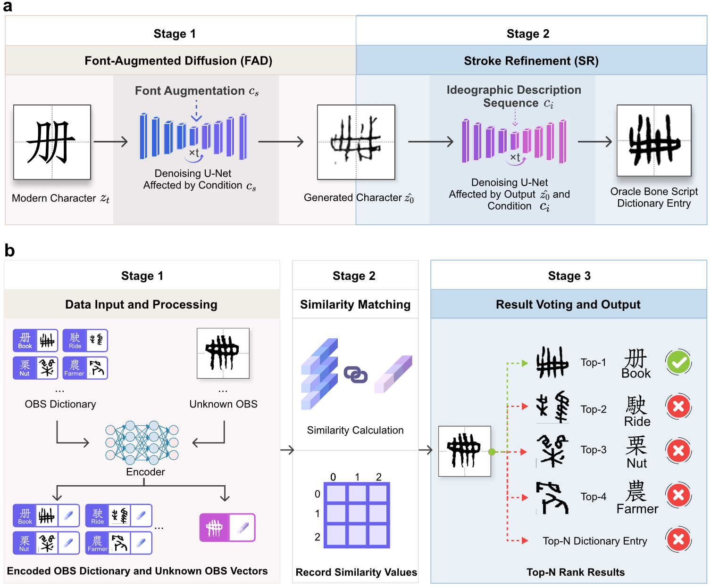

# CipherOBS: Decoding Ancient Oracle Bone Script via Generative Dictionary Retrieval

> **Official PyTorch implementation of the paper:**  
> *Decoding Ancient Oracle Bone Script via Generative Dictionary Retrieval*  
> Submitted to *Nature Machine Intelligence*

---

## Abstract

Understanding humanity's earliest writing systems is crucial for reconstructing civilization's origins, yet many ancient scripts remain undeciphered. **CipherOBS** reframes the decipherment of Oracle Bone Script (OBS) from a closed-set classification problem to a **generative dictionary-based retrieval** task.

By synthesizing a comprehensive dictionary of plausible OBS variants for modern Chinese characters (using Font-Augmented Diffusion and Stroke Refinement), our system allows scholars to query unknown inscriptions and retrieve visually similar candidates with transparent evidence. This approach achieves state-of-the-art performance on unseen characters and remains robust against archaeological degradation.

---

## System Architecture

CipherOBS employs a two-stage generative pipeline followed by dictionary retrieval:

<p align="center">
  
</p>

<p align="center">
  <a href="https://www.nature.com/natmachintell/"></a>
  <a href="https://pytorch.org/"></a>
  <a href="LICENSE"></a>
</p>

| Stage | Method | Description |
|-------|--------|-------------|
| **Stage 1** | Font-Augmented Diffusion (FAD) | Generates initial OBS drafts from modern Chinese characters |
| **Stage 2** | Stroke Refinement (SR) | Refines drafts using IDS-guided diffusion for structural fidelity |
| **Retrieval** | ConvNeXt Encoder | Matches query inscriptions against the synthetic dictionary |

---

## Table of Contents

- [Installation](#installation)
- [Data Preparation](#data-preparation)
- [Pre-trained Weights](#pre-trained-weights)
- [Training](#training)
  - [Stage 1: FAD Training](#stage-1-fad-training)
  - [Stage 2: SR Training](#stage-2-sr-training)
- [Inference](#inference)
  - [Stage 1: FAD Inference](#stage-1-fad-inference)
  - [Stage 2: SR Inference](#stage-2-sr-inference)
  - [Dictionary Retrieval](#dictionary-retrieval)
- [Project Structure](#project-structure)
- [Citation](#citation)
- [Contact](#contact)

---

## Installation

### Requirements

- Python ≥ 3.8
- PyTorch ≥ 2.0
- CUDA ≥ 11.8 (for GPU acceleration)

### Setup Environment

```bash
# Clone the repository
git clone https://github.com/your-username/CipherOBS.git
cd CipherOBS

# Create and activate conda environment
conda create -n cipherobs python=3.10 -y
conda activate cipherobs

# Install PyTorch (adjust CUDA version as needed)
pip install torch torchvision torchaudio --index-url https://download.pytorch.org/whl/cu118

# Install other dependencies
pip install -r requirements.txt
```

### Verify Installation

```bash
python -c "import torch; print(f'PyTorch: {torch.__version__}, CUDA: {torch.cuda.is_available()}')"
```

---

## Data Preparation

Prepare your data according to the following structure:

```
data/
├── train/
│   ├── input/                 # Stage 1: Source font images (modern Chinese)
│   ├── target/                # Stage 1: Target OBS images
│   ├── run_1/                 # Stage 2: Stage 1 outputs (content images)
│   └── TargetImage/
│       └── style0/            # Stage 2: Target style OBS images
│
├── test/
│   ├── input/                 # Test source images
│   ├── target/                # Ground truth OBS images
│   ├── stage1_output/         # Stage 1 inference outputs (for Stage 2)
│   └── dictionary/            # Generated dictionary for retrieval
│
├── style_reference.png        # Stage 2: Global style reference image
├── han_ids.txt                # IDS (Ideographic Description Sequence) encodings
└── glyphs.json                # Glyph vocabulary for IDS encoder
```

> **Note:** Detailed data preparation instructions are available in [`data/README.md`](data/README.md).

---

## Pre-trained Weights

> ⚠️ **Coming Soon:** Pre-trained model weights will be released upon acceptance of the paper.  
> In the meantime, you can train the models from scratch using the instructions below.

The weights will be organized as follows:

```
weights/
├── stage1/
│   └── diffusion_model.pth.tar    # Stage 1: FAD checkpoint
├── stage2/
│   └── total_model.pth            # Stage 2: SR checkpoint
└── retrieval/
    └── convnext_encoder.pth       # Retrieval encoder checkpoint
```

---

## Training

### Prerequisites

Before training, ensure you have:
1. Prepared training data (see [Data Preparation](#data-preparation))
2. Configured GPU settings in the shell scripts

### Stage 1: FAD Training

Font-Augmented Diffusion learns to generate OBS drafts from modern Chinese characters.

**Configure training parameters:**

```yaml
# configs/stage1/train.yaml
training:
  batch_size: 16
  n_epochs: 300
  resume: 'outputs/stage1/checkpoints/diffusion_model'
```

**Start training:**

```bash
# Default: 8 GPUs with distributed training
bash scripts/stage1_train.sh
```

**Monitor training:**

```bash
tensorboard --logdir outputs/stage1/logs
```

### Stage 2: SR Training

Stroke Refinement further improves the visual quality using IDS-guided diffusion.

**Prerequisites:**
- Stage 1 outputs in `data/train/run_1/`
- Style reference images in `data/train/TargetImage/style0/`

**Configure training parameters:**

```yaml
# configs/stage2/train.yaml
training:
  batch_size: 32
  max_train_steps: 50000
```

**Start training:**

```bash
# Uses Accelerate for distributed training
bash scripts/stage2_train.sh
```

---

## Inference

### Stage 1: FAD Inference

Generate draft OBS images from modern Chinese characters.

**Configure inference:**

```yaml
# configs/stage1/infer.yaml
data:
  test_data_dir: 'data/test/'
  test_save_dir: 'outputs/stage1/results/'

training:
  resume: 'auto'  # Automatically selects latest checkpoint
```

**Run inference:**

```bash
bash scripts/stage1_infer.sh

# Or with specific seed
bash scripts/stage1_infer.sh 42
```

**Outputs:** `outputs/stage1/results/`

### Stage 2: SR Inference

Refine Stage 1 outputs with stroke-level enhancement.

**Configure inference:**

```yaml
# configs/stage2/infer.yaml
data:
  input_dir: 'data/test/stage1_output/'  # Stage 1 outputs
  style_image_path: 'data/style_reference.png'

model:
  ckpt_dir: 'auto'  # Automatically selects latest checkpoint
```

**Run inference:**

```bash
bash scripts/stage2_infer.sh
```

**Outputs:** `outputs/stage2/inference/`

### Dictionary Retrieval

Match query OBS images against the synthetic dictionary.

**Configure retrieval:**

```yaml
# configs/retrieval/infer.yaml
query_dir: 'data/test/target'      # Query images (unknown OBS)
dict_dir: 'data/test/dictionary'   # Generated dictionary
model_dir: 'weights/retrieval/convnext_tri/'
```

**Run retrieval:**

```bash
# Basic usage
bash scripts/retrieval_infer.sh

# With custom directories
bash scripts/retrieval_infer.sh --query data/custom/query --dict data/custom/dict --gpu 0
```

**Outputs:** `results/retrieval/`

---

## Project Structure

```
CipherOBS/
├── configs/                    # Configuration files (YAML)
│   ├── stage1/
│   │   ├── train.yaml         # Stage 1 training config
│   │   └── infer.yaml         # Stage 1 inference config
│   ├── stage2/
│   │   ├── train.yaml         # Stage 2 training config
│   │   └── infer.yaml         # Stage 2 inference config
│   └── retrieval/
│       └── infer.yaml         # Retrieval inference config
│
├── scripts/                    # Shell scripts for training/inference
│   ├── stage1_train.sh
│   ├── stage1_infer.sh
│   ├── stage2_train.sh
│   ├── stage2_infer.sh
│   └── retrieval_infer.sh
│
├── src/                        # Source code
│   ├── stage1/                # FAD implementation
│   │   ├── models/            # Diffusion model architectures
│   │   ├── data/              # Data loading utilities
│   │   ├── train.py           # Training script
│   │   └── infer.py           # Inference script
│   ├── stage2/                # SR implementation
│   │   ├── models/            # UNet and encoder architectures
│   │   ├── data/              # IDS-aware data loading
│   │   ├── train.py           # Training script
│   │   └── infer.py           # Inference script
│   └── retrieval/             # Retrieval implementation
│       ├── models/            # ConvNeXt encoder
│       └── infer.py           # Retrieval inference
│
├── data/                       # Data directory (user-provided)
│   └── README.md              # Data preparation guide
│
├── weights/                    # Model checkpoints (coming soon)
│   └── README.md              # Download instructions
│
├── requirements.txt            # Python dependencies
│
└── outputs/                    # Training/inference outputs (auto-generated)
```

---

## Citation

If you find this work useful, please cite our paper:

```bibtex
@article{CipherOBS2025,
  title   = {Decoding Ancient Oracle Bone Script via Generative Dictionary Retrieval},
  author  = {Wu, Yin and Zhang, Gangjian and Chen, Jiayu and Xu, Chang and Luo, Yuyu and Tang, Nan and Xiong, Hui},
  
  journal = {Submitted to Nature Machine Intelligence},
  year    = {2025}
}
```

---

## Contact

For questions or issues regarding the code or paper, please:

1. Open an issue in this repository
2. Contact the author: **Yin WU** ([ywu450@connect.hkust-gz.edu.cn](mailto:ywu450@connect.hkust-gz.edu.cn))

---

<p align="center">
  <i>Bridging millennia through machine intelligence</i>
</p>
